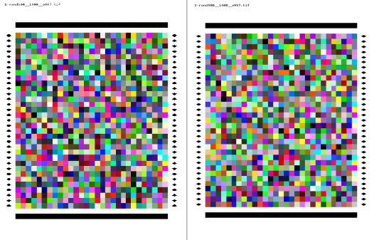
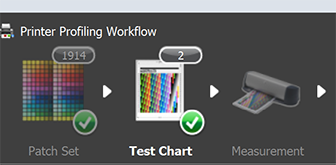
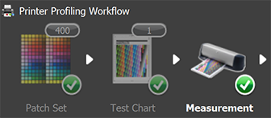
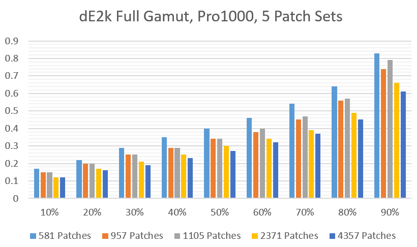

# i1Patches
<!-- See [create an anchor](#Technical-Overview) -->

## Program to create patch charts and evaluate profile accuracy

**In a single printing pass, create and verify accuracy of one or more ICC
profiles from one or more sets of RGB profiling patches.**

**i1Patches** Is a Windows based tool principally used to aggregate and randomize one or more,
printer profiling patch sets along with randomly generated patches for independent accuracy verification.
It produces tif and CGATs files compatible with XRite's i1Profiler and i1iSis or i1Pro2
spectrophotometers.

It is particularly good at removing externalities that strongly affect comparing different profile
patch sets. These have been typically evaluated by printing charts, measuring patch color,
making profiles, printing sets of known colors with these profiles, and finally, measuring these prints
and comparing mesasured colors to patch RGB value colors.

The following can, and does, make this usual practice difficult and uncertain:
I've seen these effects result in a 500 patch profile appearing to be more accurate
than an 1,800 patch profile.

- Environmental variations such as changes in temperature and humidity that change the dynamics of dot size as ink drys.
- Printer variations that occur between successive page prints from warmup. Inking differences as
  new ink flows out of cartridges, through supply tubes, and into the print head.
- Print head technology. Canon and Epson heads differ and have different drift characteristics through a print job.
- Printer algorithms. An example is when the printer decides it's time to jiggle the inks
  partway through a print job. I've noticed on the Canon Pro1000.
- Paper characteristic changes. Each page may not ink the exact same way due to manufacturing or storage variation.
  For example the first page in a paper package can exhibit significant shifts on papers with high OBA levels
  due to more air exposure.

#### Requirements
Windows 10 x64, 
XRite i1isis or i1Pro2 Spectrophotometers together with i1Profiler software
than can read printed patches and produce a CGATs file.
i1Profiler and an i1isis spectro are ideal because the program creates tif image files that
have a registration bar on the top and bottom of the chart. These charts can be read from bottom to top.
This allows the charts to be optionally scanned in reverse order to create a reversed CGATs file.
I1Pro2 charts that are 21 rows by 29 columns can also be created.

#### Overview
CGATs RGBs and printable tif images for scanning with an i1isis or i1Pro2 are created from existing patch sets
and/or randomly generated sets. The CGATs RGB files
are read, randomized, and combined.  A header where the names and sizes of the files
are encoded in the initial RGB values. Also, 4 neutrals and 6 CYM colors are added along the right
edge of each image. These are used to check printer consistency as each page is printed. Sometimes
a print gradually changes as each page is printed. These check colors are used to gather consistency info.

After the printed charts are measured, the "-R" command is used to extract de-randomized measurement
files. These have the same RGB values as the original CGATs RGB patch files but also includes measurement
data such as L\*a\*b\*, XYZ, Spectra, etc. Each extracted file is used to make ICC
profiles and/or evaluate the profiles for accuracy.

#### Details on each Option

A subdirectory showing an example of each of the options is provided and labeled ***option_#*** where
***#*** is the letter for each option. Readme links below.

Typical use to create charts, measure, and analyze profiles
[Options TRC Details](option_trc/option_trc.md) 
Create a new CGATs file from 1 or more others with optional range selection.
[Option A Details](option_a/option_a.md) 
Evaluate CGATs measurements against one or more ICC profiles.
[Option C Details](option_c/option_c.md) 
De-randomize and Extract measurement CGATSs files.
[Option R Details](option_r/option_r.md) 
Compare two CGATs identical measurement files.
[Option S Details](option_s/option_s.md) 
Aggregate one or more CGATs RGB files and random RGB sets.
[Option T Details](option_t/option_t.md) 
Synthesize measurement files from an RGB CGATs file and an ICC profile.
[Option X Details](option_x/option_x.md) 
Create drift measurement charts and evaluate drift.
[Option Z Details](option_z/option_z.md) 

### Example of Typical Usage
 The full example and all required files are in directory **.\option_trc**. Three batch files,
execute_t.bat, execute_r.bat, and execute_c.bat run all the code except for making the 4 ICC profiles
which requires i1Profiler. Here's a quick walkthrough.
We start with two RGB CGATs patch sets having 400 and 957 patches.

    i1Patches -T 33 -e 500 i400.txt o957.txt

The program combines the patches in i400.txt and o957.txt with generated random patches
from the "-e 500" option.
The generated patches are designed to test device neutral, low saturation, and full gamut accuracy.
Two full US letter size tif images, 33 rows by 29 columns, as well as the associated
CGATs RGB fwd/rev files are created. The tif files must be printed without color management.
They also have registration bars on both the top and bottom to allow reading forward or reverse.

The CGATs RGB files created are rand500__i400__o957.txt (fwd) and rand500__i400__o957r.txt (rev). The
reverse set is optional and used to measure the prints in reverse order. This
provides a self check. Also supplied are ".txf" aka, Chart files. These have both RGB values and
dimension info to initialize i!profiler to prepare to scan the printer charts. These can be dragged
and dropped onto the Test Chart tab.

Whether you use the CGATs RGB files or the ".tfx" chart files make sure the printed charts correspond
to that which appears in i1Profiler's windows.

See [**here**](#Advantages-of-a-forward-and-reverse-scan) for
an example how forward/reverse scans detected contamination in an i1isis.
If a reverse measurement is made it's averaged and the 5 largest dE errors
from the forward and reverse files are listed. The measurement files should be saved as CGATS with
the same name ending in "_Mn.txt" where n is the uV mode. The reverse measurement file, if made,
should have exactly the same name except with an "r" appended to the base name prior to the _Mn.txt.
For this example the regular measurement file is: P_rand500__i400__o957_M2.txt. The reverse
measurement file, if used, should be named P_rand500__i400__o957r_M2.txt.

The next step is to extract the embedded CGATs files with the command:

    i1Patches -R P_rand500__i400__o957_M2.txt

This extracts 3 CGATs measurement files: rand500_M2.txt, i400_M2.txt and o957_M2.txt.
Profiles are then made from i400_M2.txt and o957_M2.txt with i1Profiler (in advanced mode)
by dragging and dropping them onto the measurement tab.

rand500_M2.txt is the measurement file profiles will be tested against.
ICC profiles can then be created using various options such as 16bit or 8bit
and high, medium, low lookup table grids. The profiles should be named as desired when created.
After creating ICC profiles the next step is to determine the color accuracy of each profile:

    i1patches -C rand500_M2.txt i400_small_8bit.icm i400_medium_16bit.icm o957_small_8bit.icm o957_medium_16bit.icm

This analyzes each profile making a histogram of deltaE for device neutral, low saturation, and
the full gamut. Here's the summary of the 4 profiles.

    Device Neutrals  Low Saturation    Full Gamut
     dE76  dE2k       dE76  dE2k       dE76  dE2k
     1.11  1.11       0.93  0.72       1.18  0.61       i400_small_8bit.icm
     0.91  0.86       0.73  0.58       0.99  0.53       i400_medium_16bit.icm
     0.85  0.87       0.85  0.67       0.99  0.54       o957_small_8bit.icm
     0.47  0.45       0.55  0.43       0.72  0.42       o957_medium_16bit.icm

### A large Comparison Set

Here's a histogram of dE2ks for 4, i1Profiler default patch sets as well
as my own, crafted, 957 patch set that fits on a single, US Letter page.
The 957 crafted patch set produces better profiles than either the default isis 957 patch set
or the 1105 Xrite patch set and fits one one page.

The following command created 12 pages of 957 patches each. It combines 5
sets of increasing profile patch counts. It also generates a 1500 patch set for testing
accuracy and a smaller, 250 patch set normalized with an existing ICC profile.
This can be found in the directory: "Pro1000\isis_range" along with files
created from the -R and -C command after printing and scanning.

    i1patches  -T 33 -e 1500 -e 250 i957_m2.icm p581.txt p1105.txt p2371.txt p4357.txt o957.txt

## i1Patches Commands and Options

    i1Patches -[T|T2] n_rows [-e size] patch_set1.txt, patch_set2.txt, ...
        Create RGB i1Profiler "txf" chart, CGATs, and tif image files. "n_rows" specifies the number of
        rows on each page. It must be between 21 and 33 for i1isis, the "-T" option
        and exactly 21 for the i1Pro2, the "-T2" option.
        There are always 29 columns. Recommend 33 rows for full i1isis profile page size.
        The optional "-e size" can be used to create a set of "size" RGB patches to compare
        profile performance against. 500 or more will provide reasonable statistical
        comparisons of accuracy between profiles. zero or more "-e" options are allowed.
        if no size argument is provided, a default of 250 is used.
    
    i1Patches -[T|T2] n_rows [-e size dup_count] patch_set1.txt, patch_set2.txt, ...
        Same as above but all the "-e" patches generated are duplicated. This provides a means
        of determining how much variation occurs when the same RGB patches printed
        in different locations.

    i1Patches -[T|T2] n_rows [-e size dup_count random_seed] patch_set1.txt, patch_set2.txt, ...
        Same as above but seed can be specified with specific values used to create
        the random patch set. This can be useful to check the variation that occurs
        by creating multiple patch sets with or without the same RGB values.

    For all:
        if (size >= 250)  add 52 neutral axis RGBs, split remaining among low saturation and full gamut.
        if (size > 100)   add 18 deutral axis RGBs, split remaining among low saturation and full gamut.
        if (size <= 100)  add full gamut randomly spread RGB patches.
        
    i1Patches -[T|T2] -n_rows patch_set.txt
        Note: n_rows is negative!. No coded structure or randomization applied.
        This generates tif files and forward/reverse CGATs RGB files _x appended to
        the base name. Useful for making tif profile targets that can be read both forward and
        reverse with an i1isis spectro. RGB CGATs file will be expanded
        with white patches to be a multiple of 29*n_rows.
        It also prevents randomization so produces charts the same as would appear in i1Profiler.

    i1Patches -[t|t2] ....
        Same as "-T" above but only create i1Profiler iSiS/i1Pro2 "txf" and RGB CGATs files.
        It doesn't create tif images files. Use this when using
        i1Profiler to print target images from the txf files. The
        CGATs files must be used with care to set the
        page values to defaults for profile (i1isis) or landscape (i1isis) US letter size.
        i1Profiler uses the default patche sizes: 6mm for i1isis (Profile)
        and 8mm (Landscape) for i1Pro2 on US letter size paper.

---
    i1Patches -R measurement_file_M2.txt
        Extract measurement files. Note that files can end in _M0.txt, _M1.txt of _M2.txt.
        Measurement file should be in i1Profiler's CGATs format that includes,
        at a minimum, RGB and Lab values. Recommend selecting all fields including
        spectral data. For added data integrity, tif files can be scanned
        in reverse from bottom to top and last to first page. If a CGATs measurement file
        of the same name except ending in r_M#.txt instead of _M#.txt exists the
        two files will be averaged and statistics printed on how closely the
        patches match. This is useful for detecting transient issues such as lint on the print.

    i1Patches -Ra measurement_file_M2.txt
        Same as above but also creates an Argyll batch file to generate profiles. Modify as desired.

    i1Patches -r measurement_file_M2.txt
        Same as above but doesn't extract files. Just outputs statistics.

    i1Patches -Rx measurement_file_M2.txt
        Only averages and saves the forward and reversee scans and prints stats. The averaged
        file will be saved as *_ave_M2.txt. Can be any set of forward/reverse measurement files.
        No structure, as produced with "-T" option, is required.
---
    i1Patches -C test_patches_M2.txt profile1.icm profile2.icm ....
        Evaluate profile(s) accuracy by determining the Lab values that generated a
        corresponding RGB values and comparing them against the measured Lab values.
        A high precision search is performed using BtoA profile tables.

    i1Patches -c test_patches_M2.txt profile1.icm profile2.icm ....
        Same as above but only AtoB tables in profiles are used.
        This is faster but less accurate than the "-C" option since only BtoA tables are used.
---

    i1Patches -A cgats_combined.txt cgats1.txt [start stop] cgats2.txt [start stop] ....
        Combines and one or more CGATs files. Files can be RGB
        only or measurement files but must all have the same type and layout.
        Optionally, start and stop indexes can be specified for each cgats. For instance:
        "cgats1.txt 10 55" will retrieve the 10'th through 55'th entries.
        Multiple ranges can be given. "cgats1.txt 1 5 7 10" will retrieve
        the first 9 values skipping the 6th.
        After combining the patches are randmized and the CGATs file is saved.

    i1Patches -Ad cgats_combined.txt cgats1.txt cgats2.txt ....
        Same as above each CGATs file is firsst de-randomized then the optional
        [start stop] selection is applied.

    i1Patches -a cgats_combined.txt cgats1.txt cgats2.txt ....
        Same as above but patches are not randomized or de-randomized
---
    i1Patches -X noise0 noise1 cgats_aggregate_rgb_file.txt iccProfile.icm
        Generates pseudo forward/reverse measurement files using reference profile.
        Useful for testing and provides patch quaility info that tracks printed
        charts without printing. Provides initial guidance for selecting patch sets
        to print and test. noise0 and noise1 are the standard deveation of gaussian noise added
        to synthesized Lab values from the RGB file.
        noise0 should approximate the printer's patch to patch variation. noise1 should
        approximate spectro instrument variation when reading the same patches.
        I use noise0=.2 and noise1=.05
---
    i1patches -Z rows file.txt
        Create printer drift pattern and neutral ramp for testing color patch stability.
        A RGB 4x4x4 plus 2:2:30 dev neutrals repeated to fill selected size
        rows*29 total patches. rows must be between 21 and 33 inclusive.
        Created are an i1isis compatible file.tif and cgats files, file.txt and filer.txt.
        
    i1patches -Z measurementfile1.txt [measurementfile2.txt]
        Evaluate patch color consistency and L* ramp to adjust ink levels.
        For two files, evaluate statistical differences between the two measurement files. This is
        intended to test variation over time of 1 printed chart or comparing measurements
        from 2 charts that were printed at different times, possibly with different ink levels
        or after changing ink.
---
    i1patches -S file1.txt file2.txt
        Compare two measurement files that have the same RGB values in the same sequence.
        Useful to look at time variation in colors, paper/ink longevity

#### Advantages of a forward and reverse scan
Small scanning errors are normal and this provides a way to scan patches and slightly reduce these errors.
Errors can also show up that indicate contamination such as dust in the optical path or transient lint on a chart.
This is an example where the forward/reverse scan showed significant errors from lint in the i1isis spectro. These
were made evaluating very small patch sets but would have cause significant, and unnoticed errors
without making a reverse measurement file.

    i1patches -r P_rand1432__Neut50__t189__t216__t512__t559__t729X_M2.txt
    6 black patches, ave Lab:  2.00 -0.05 -0.36
    6 white patches, ave Lab: 94.76 -1.52 -1.85
    33 rows, 4 pages
    ....
    Forward/Reverse stats, 5 worst dEs
    Patch#  dE76        RGB              Lab Forward               Lab Reverse         page  row  column
      14    4.19      0 116  55     18.79  -34.48   -7.55      19.73  -30.48   -6.73    1     14     1
    1924    4.02      9  16  11      6.47   -0.68    0.53       8.77    1.80    2.71    3     10     1
     979    3.96     28 152  24     32.93  -44.37   18.06      33.77  -40.52   18.45    2     22     1
      26    3.18     16   0  61     10.07   21.42  -16.37      11.88   20.93  -13.80    1     26     1
     223    2.85    255 128   0     69.84   37.62   89.56      69.81   37.15   86.75    1     25     7

                 dE76 distribution (less than)
       10%   20%   30%   40%   50%   60%   70%   80%   90%   95%   99%
      0.08  0.10  0.13  0.15  0.17  0.20  0.23  0.27  0.35  0.53  1.58

This is fairly rare. I've only seen it a few times. In this case the instrument was opened up and pressurized air
use to remove contamination. New forward/reverse scans produced this more typical results:

    Forward/Reverse stats, 5 worst dEs
    Patch#  dE76        RGB              Lab Forward               Lab Reverse         page  row  column
    2219    0.70      0 255  96     38.68  -77.98   -3.66      38.90  -77.33   -3.50    3      8    10
    2058    0.65    255 219   0     83.68    6.85  104.18      83.24    6.78  103.70    3     12     5
    1140    0.57    255   0  64     49.12   76.90   57.11      48.99   76.66   56.61    2     18     6
    2206    0.53      0  73   0     17.82  -25.77   10.25      17.69  -26.28   10.30    3     28     9
    2789    0.51     49  32   0     16.73    8.45   15.81      16.87    8.42   15.32    3     17    27

                 dE76 distribution (less than)
       10%   20%   30%   40%   50%   60%   70%   80%   90%   95%   99%
      0.06  0.08  0.10  0.12  0.14  0.16  0.18  0.21  0.25  0.29  0.37

