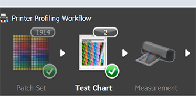

### Option T, R, and C: An example comparing the performance of two patch sets

Create charts to compare performance of one or more patch sets. Combines one or more RGB patch sets
with optional, independantly generated random RGB patches.

#### Summary of the 3 steps for typical use of i1Patches

As an example we use the i1Profiler 400 patch set and a custom 957 patch set.
Initial RGB files: **i400.txt**, a CGATs RGB set from i1Profiler and **o957.txt**, a CGATs RGB
set. This batch file creates 2 pages of charts containing the aggregated RGB patch
sets as well as forward/reverse CGATs and ".txf" i1Profiler chart files for measuring prints.

    batch command: execute_t
    i1patches -T 33 -e 500 i400.txt o957.txt

The next batch file extracts forward/reverse averaged CGATs measurement patch files
i400_M2.txt and o957_M2.txt, as well as the random RGB file, "rand500_M2.txt", 
used for analysis of profile accuracy.

    batch command: execute_r
    i1patches -R rand500__i400__o957_M2.txt

Then the ICC profiles from the 2 measurement files are created using i1Profiler. 2 profiles
are created from each measurement file to compare relative performance. 8 bit, small grid
and 16 bit medium grid. The rand500_M2.txt file is then used to evaluate each
of the 4 profiles.

    batch command: execute_c
    i1patches -C rand500_M2.txt i400_small_8bit.icm i400_medium_16bit.icm o957_small_8bit.icm o957_medium_16bit.icm

### Details

****Note for users of Adobe ACPU print utility**** 
*When using Adobe's ACPU utility to print tif files without color management add "ACPU"
as the first argument preceding the "-T" like this **i1Patches ACPU -T ...rest of command...**. This expands the
printed image by 2% to mostly correct for ACPU's tendecny to shrink prints slightly.*

The following command aggregates these patch sets and adds an independant, 500 evaluation patch set.

    i1Patches -T 33 -e 500 i400.txt o957.txt

Console output which describes the two tif charts generated:

    Command: i1patches  -T 33 -e 500 i400.txt o957.txt
    Randomizing and adding edge check colors
    2 pages of 33 rows with 29 columns
    23 check colors are added to the right edge of each page
    Randomized patch count=1857
    Total patch count=1914
    7 patches can be added before additional pages are created
    Creating single, grouped CGATs and Tif image files: rand500__i400__o957

This created two tif files and related CGATs and chart pxf files. The chart file **rand500__i400__o957.txf**,
can be loaded into the i1Profiler to print charts using i1Profiler's printing capability.

However the tiff charts can be printed with other utilities and have additional registration bars on the
bottom. This allows these charts to be reverse scanned from last to first and bottom to top using the chart
"txf" file **rand500__i400__o957r.txf**.

    1-rand500__i400__o957.tif       Tif file, page 1
    2-rand500__i400__o957.tif       Tif file, page 2

    rand500__i400__o957.txt         CGATs RGB, for normal scan
    rand500__i400__o957r.txt        CGATs RGB, for reverse scan
    rand500__i400__o957.txf         i1Profiler chart (txf), for normal scan
    rand500__i400__o957r.txf        i1Profiler chart (txf), for reverse scan

To scan printed charts, drag
the file **rand500__i400__o957.txf** and drop on the "test chart" icon to initialize
the test chart dimensions and layout. Then it's ready to measure the charts with the
i1isis spectrophotometer. After measurement, the measurement data should
be saved as a CGATs file. Click the save button then save having the same name as the charts
but ending in _Mn.txt where "n". The latter is added automatically when you save as a CGATs.
If you scanned multiple uV modes in the i1isis XL it will save each 3 files with names
ending in _M0, _M1, and _M2. If you select custom CGATS, it will open a dialog asking
what you wish saved. Select all option to preserve but files must include RGB and Lab
data at a minimum. Defaults are fine.
I generally use M2 (uV cut) since most display illuminants these days produce very little uV.
Since Relative and Perceptual printing always scales to paper white, there is little difference
between the modes. But if you print absolute Colorimetric, you can see large differences
on any paper with significant amounts of optical brighteners if the display uV doesn't
match the assumed amounts in M0, M1, or M2.

These are the saved CGATs i1isis measured files:

    rand500__i400__o957_M2.txt
    rand500__i400__o957r_M2.txt

#### Extracting the embedded CGATs files

The next step is to execute the -R option. This de-randomizes and extracts the embedded
CGATs files creating individual CGATs files for each patch set. Extracted
measurement files are automatically averaged in a reverse measurement file exists.

    i1patches -R rand500__i400__o957_M2.txt

This produces CGATs measurement files just as if you had created and measured them individually.

    rand500_M2.txt
    i400_M2.txt
    o957_M2.txt

In addition, since we included a reversed CGATs measurement file, it is averaged with
the forward scan and saved as **rand500__i400__o957_ave_M2.txt**.

The extracted profile patch measurement files are then used to create profiles by
dragging and dropping them on the Measurement icon.

#### To evaluate one or more profiles use the -C option with the random set followed by one or more ICC profiles.

You can now go through the rest of the process selecting whatever options you use
to make profiles. The small and medium produce 17x17x17 and 33x33x33
grid sizes. The cool thing with this approach is you can compare these without
printing any new charts. Here's the results with my Canon Prograf 1000 on glossy.

    Device Neutrals  Low Saturation    Full Gamut       profiles with 400 patches
     dE76  dE2k       dE76  dE2k       dE76  dE2k
     1.11  1.15       0.94  0.73       1.21  0.63       i400_small_8bit_M2.icm
     0.88  0.83       0.74  0.58       1.02  0.54       i400_medium_16bit_M2.icm

    Device Neutrals  Low Saturation    Full Gamut       profiles with 957 patches
     dE76  dE2k       dE76  dE2k       dE76  dE2k
     0.81  0.83       0.87  0.67       1.00  0.53       o957_small_8bit_M2.icm
     0.45  0.44       0.54  0.42       0.74  0.41       o957_medium_16bit_M2.icm

    i1patches -C rand500_M2.txt i400_medium_16bit_M2.icm o957_medium_16bit_M2.icm

This creates a detailed breakdown of device neutral, low saturation and full gamut
colors including a histogram for each profile.

    Command: i1patches  -C rand500_M2.txt i400_medium_16bit_M2.icm o957_medium_16bit_M2.icm
    Creating Results File: rand500_M2__i400_medium_16bit_M2.icm.txt

    ---Using profile i400_medium_16bit_M2.icm to analyze 500 patches, Dup Count: 1---

    Neutrals N=52, Ave Sat:  2.70
          Delta E 1976  Ave:0.883, Est. error of Ave:0.066
          Delta E 2000  Ave:0.832, Est. error of Ave:0.064

                                          dE distribution (percent less than)
                        Ave         10%   20%   30%   40%   50%   60%   70%   80%   90%
      Delta E 1976:    0.88        0.28  0.49  0.56  0.73  0.80  0.94  1.12  1.35  1.61
      Delta E 2000:    0.83        0.25  0.40  0.48  0.66  0.78  0.87  1.00  1.27  1.53

    Low Saturation N=224, Ave Sat: 17.53
          Delta E 1976  Ave:0.738, Est. error of Ave:0.032
          Delta E 2000  Ave:0.580, Est. error of Ave:0.026

                                          dE distribution (percent less than)
                        Ave         10%   20%   30%   40%   50%   60%   70%   80%   90%
      Delta E 1976:    0.74        0.25  0.38  0.48  0.56  0.66  0.73  0.81  0.99  1.34
      Delta E 2000:    0.58        0.19  0.28  0.37  0.43  0.50  0.55  0.66  0.78  1.06

    Full Gamut N=224, Ave Sat: 48.38
          Delta E 1976  Ave:1.022, Est. error of Ave:0.047
          Delta E 2000  Ave:0.544, Est. error of Ave:0.023

                                          dE distribution (percent less than)
                        Ave         10%   20%   30%   40%   50%   60%   70%   80%   90%
      Delta E 1976:    1.02        0.34  0.44  0.56  0.70  0.85  0.95  1.24  1.58  1.88
      Delta E 2000:    0.54        0.18  0.26  0.32  0.39  0.46  0.53  0.68  0.82  0.99

    Creating Results File: rand500_M2__o957_medium_16bit_M2.icm.txt

    ---Using profile o957_medium_16bit_M2.icm to analyze 500 patches, Dup Count: 1---

    Neutrals N=52, Ave Sat:  2.70
          Delta E 1976  Ave:0.449, Est. error of Ave:0.038
          Delta E 2000  Ave:0.436, Est. error of Ave:0.038

                                          dE distribution (percent less than)
                        Ave         10%   20%   30%   40%   50%   60%   70%   80%   90%
      Delta E 1976:    0.45        0.17  0.22  0.25  0.29  0.42  0.48  0.54  0.70  0.83
      Delta E 2000:    0.44        0.15  0.22  0.24  0.29  0.37  0.43  0.55  0.65  0.83

    Low Saturation N=224, Ave Sat: 17.53
          Delta E 1976  Ave:0.540, Est. error of Ave:0.024
          Delta E 2000  Ave:0.420, Est. error of Ave:0.019

                                          dE distribution (percent less than)
                        Ave         10%   20%   30%   40%   50%   60%   70%   80%   90%
      Delta E 1976:    0.54        0.21  0.27  0.35  0.42  0.46  0.54  0.65  0.76  0.85
      Delta E 2000:    0.42        0.15  0.22  0.25  0.31  0.36  0.42  0.47  0.57  0.74

    Full Gamut N=224, Ave Sat: 48.38
          Delta E 1976  Ave:0.737, Est. error of Ave:0.034
          Delta E 2000  Ave:0.414, Est. error of Ave:0.018

                                          dE distribution (percent less than)
                        Ave         10%   20%   30%   40%   50%   60%   70%   80%   90%
      Delta E 1976:    0.74        0.24  0.33  0.46  0.51  0.64  0.72  0.82  0.99  1.35
      Delta E 2000:    0.41        0.15  0.21  0.26  0.31  0.35  0.40  0.46  0.59  0.73
